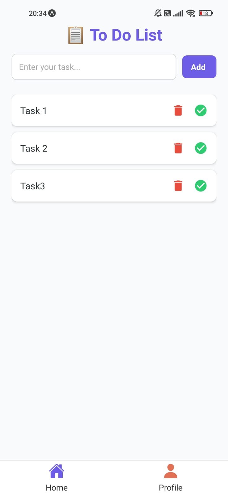
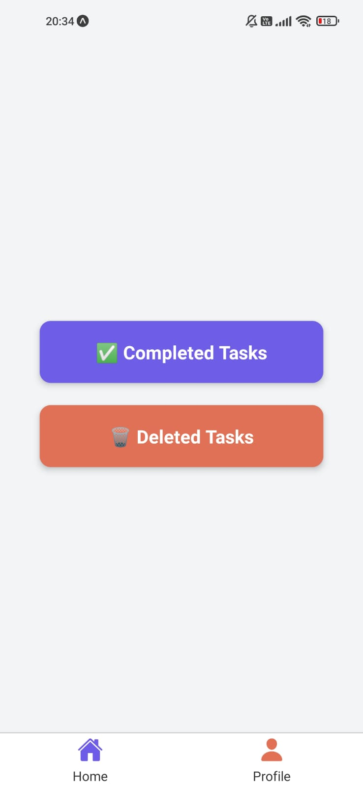

# 📋 To-Do List React Native App

A simple To-Do List application built with **React Native** using **Expo**. This app allows users to add, complete, and delete tasks. Completed and deleted tasks are accessible in the Profile section. Data persistence is handled via **AsyncStorage**.

---

## 🚀 Features

- Add new tasks
- Mark tasks as completed
- Delete tasks
- View completed and deleted tasks
- Persistent data storage using AsyncStorage
- Bottom navigation bar for easy navigation

---

## 📱 Screens

1. **Home Screen:** Add tasks, mark them as completed, or delete them.
2. **Profile Screen:** View lists of completed and deleted tasks.

---

## 🛠️ Installation

1. **Clone the repository:**

```bash
https://github.com/your-repo/todo-app.git
cd todo-app
```

2. **Install dependencies:**

```bash
npm install
```

3. **Run the project:**

```bash
npx expo start
```

4. **Open on a device:**
   - Scan the QR code with the Expo Go app on your phone.
   - Or run on an emulator using the options provided.

---


---

## 📦 Dependencies

- **React Native**
- **Expo**
- **@react-navigation/native** (for navigation)
- **@react-navigation/native-stack** (stack navigation)
- **react-native-vector-icons** (icons)
- **@react-native-async-storage/async-storage** (persistent storage)

---

## ⚙️ Key Functionalities

### Adding a Task
- Input your task in the text box.
- Press the **Add** button to save the task.

### Marking as Completed
- Press the ✅ **check icon** to mark the task as completed.

### Deleting a Task
- Press the 🗑️ **delete icon** to move the task to the deleted section.

### Viewing Tasks
- Navigate to the **Profile** section.
- Choose between **Completed Tasks** and **Deleted Tasks**.

---

## 💾 Data Persistence

The app uses **AsyncStorage** to save tasks locally on the device. Tasks, completed tasks, and deleted tasks are stored separately and automatically synced when the app is launched or updated.

---
## 📸 Screenshots

<div style="display: flex; gap: 10px;">
  
  
</div>


## 💡 Future Improvements

- Add task editing functionality
- Implement task prioritization
- Add due dates and reminders
- Improve UI with animations

---

## 🤝 Contributing

1. Fork the repository
2. Create your feature branch: `git checkout -b feature/YourFeature`
3. Commit your changes: `git commit -m 'Add new feature'`
4. Push to the branch: `git push origin feature/YourFeature`
5. Open a pull request

---

## 📄 License

This project is licensed under the [MIT License](LICENSE).

---

## 🙋‍♂️ Author

- **Hakan Berkiten** - [GitHub Profile](https://github.com/hakanberkiten)
